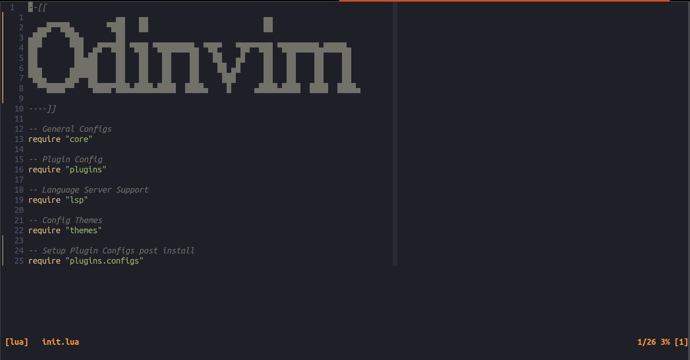
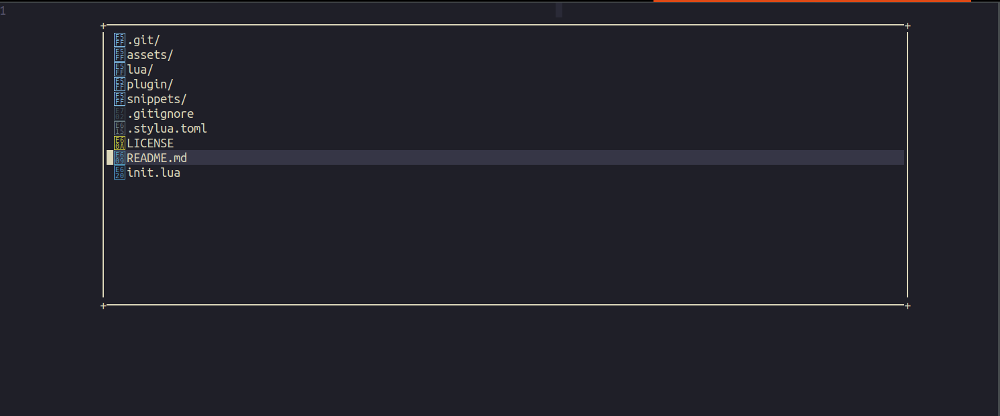

# Odinvim

Author: Nicholas O'Kelley



## Motivation

Maintain a slim configuration to aid development without introducing more 
friction to the workflow inside Neovim.

## Installation

### Prerequisites

- Neovim release v0.8
  - Note: I build from source.

- If you wish to utilize the `live_grep` (`<leader>g`) portion of the [Telescope plugin](https://github.com/nvim-telescope/telescope.nvim)
  - `ripgrep (rg)`

- `pip install pynvim`

### Installing the Configuration

Assuming you have the extra bits installed, the rest will be a breeze.

```
git clone https://github.com/OkelleyDevelopment/Odinvim.git ~/.config/nvim
```

Then follow the next sequence of steps:

1. Open Neovim and wait for the installs to finish
2. Exit Neovim
3. Resume as normal
4. Get healthy via:

```
:checkhealth
```


## Note on Key Mappings

The key mappings are bootstrapped from within the `lua/config/keys.lua`. If you
wish to remove, simply comment out or delete the line.

If you wish to add a mapping, it is made easy with a utilities function in the format:

```
utils.map(mode, mapping, command, opts)
```

The basic modes include {'n': normal, 'i': insert, 'v': visual}. The `mapping` is the
keys you will press to get the action, and `command` is the command that would execute once
the mapping is made.

## Extra Pictures

### Demo of `lir.nvim`



### Demo of `nvim-telescope`


## Why Odinvim?

I like projects with fun names and was originally trying to find a way to include
`OkelleyDevelopment`. This then shifted to the fun play on the initials `OD` to
become `Odinvim`.
