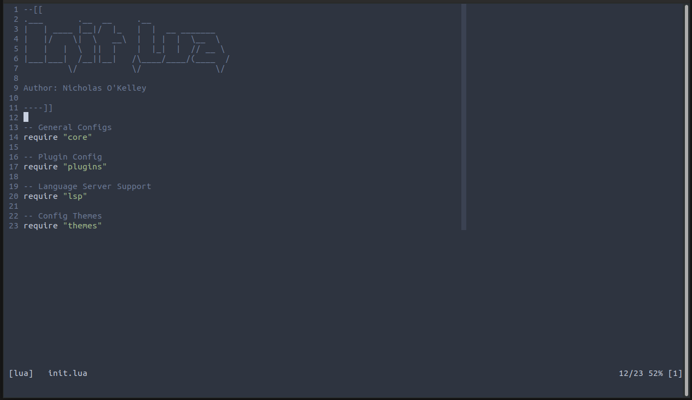

# Odinvim

Author: Nicholas O'Kelley



## Motivation

Instead of relying on third party plugins for LSP like my old ([Nvim-config](https://github.com/OkelleyDevelopment/Nvim-Config)),
this refresh aims to harness the power of the built in LSP that NeoVim 0.5+ offers.

This configuration is by no means perfect and will continue to be updated as my work-flow
evolves.

## Included Features

- [x] Git signs (changes, add, or removal)
- [x] File browsing
- [x] Auto-pairs
- [x] A few color schemes to get started
- [x] LSP support
  - [x] nvim-lsp-installer helps a ton in this area
- [x] Autocomplete (Just need to setup the servers correctly to your needs)
  - [x] friendly-snippets has some good stuff here too
- [x] Telescope
- [x] Format on save utilizing `null-ls`
- [x] Zen mode


## Setup

### Prerequisites

- NEOVIM (v0.5.0+)
- Install the following for my setup:
  - `cargo install stylua` (lua formatter)
  - `pip install black` (python formatter)
  - `npm install -g prettier` (Assumes your npm setup is for user level perms only)
    - `clangd`
    - `pip install pynvim`
    - `npm i -g neovim`
      - Make sure you configure Node to be user level (no sudo + node)
    - `ripgrep (rg)`
      - If you wish to utilize the `live_grep` (`<leader>g`) portion of the Telescope plugin

I've shift my opinion on how installs will work, for now just manually make sure they
are installed and things should work smoothly.

## Manual Install

**IMPORTANT**: Keep in mind this config is built on Neovim v0.7.0+

```
git clone https://github.com/OkelleyDevelopment/Odinvim.git ~/.config/nvim
```

## Feature Breakdown

### Key Mappings

The key mappings are bootstrapped from within the `lua/config/keys.lua`. If you
wish to remove, simply comment out or delete the line.

If you wish to add a mapping, it is made easy with a utils function in the format:

```
utils.map(mode, mapping, command, opts)
```

The basic modes include {'n': normal, 'i': insert, 'v': visual}. The `mapping` is the
keys you will press to get the action, and `command` is the command that would execute once
the mapping is made.

### Plugins (`./lua/plugins/plugs.lua`)

- `packer.nvim` - lua plugin manager to auto-install and update plugins

### Tools and Utilities

- `lir.nvim` - Simple file explorer for easier file navigation around projects
- `gitsigns` - git gutter indicators and hunk management
- `nvim-telescope/telescope.nvim` - Project fuzzy finder
- `folke/zen-mode.nvim` - Distraction free mode (Minor Adjustments to be made)

### LSP and Code Completion

#### Snippet Support

- `L3MON4D3/LuaSnip` - A snippets engine
- `rafamadriz/friendly-snippets` - A collection of snippets
- `saadparwaiz1/cmp_luasnip` - snippet completion

#### Code Completion

- `hrsh7th/nvim-cmp` - Autocompletion framework

#### Language Servers

- `neovim/nvim-lspconfig` -- Collection of configurations for built-in LSP client
- `williamboman/nvim-lsp-installer` -- simple to use language server installer
- `tamago324/nlsp-settings.nvim` -- language server settings defined in JSON

### Appearance

- Themes - Themes found around that I felt were neat, more can be added :)
  - Onenord (Currently Set)
  - Material Ocean
  - Tokyonight
  - Rose-pine
  - Nord

## Extra Pictures


